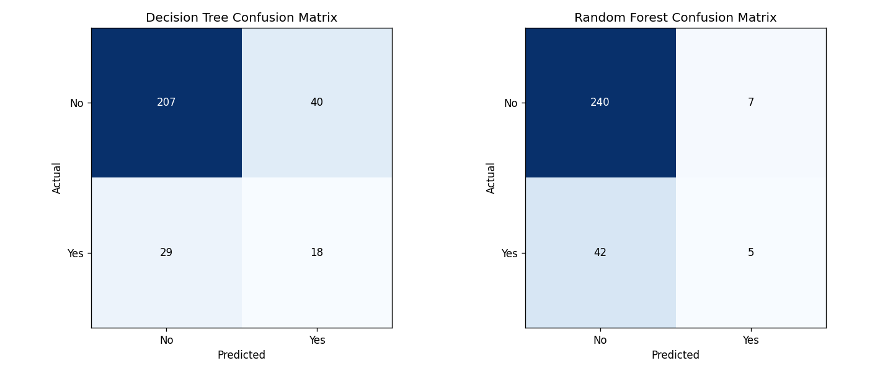
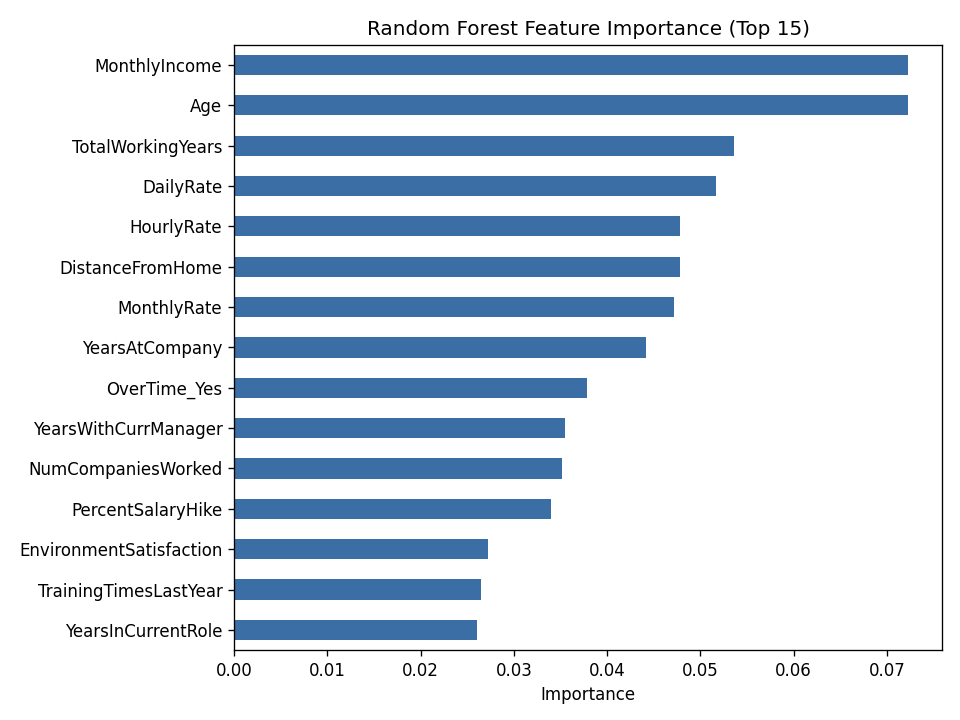

# Employee Attrition Prediction using Decision Tree and Random Forest Classification

## Objective
A company wants to identify employees who are likely to leave the organization based on their demographic, professional, and work-related attributes. This project builds both Decision Tree and Random Forest classification models to predict employee attrition (`Attrition`) and compares their performance.

## Dataset
**IBM HR Analytics Employee Attrition & Performance Dataset**
Source: [Kaggle — pavansubhasht/ibm-hranalytics-attrition-dataset](https://www.kaggle.com/datasets/pavansubhasht/ibm-hranalytics-attrition-dataset)

The dataset is **not included** in this repository. Download it directly from the Kaggle link above and place `WA_Fn-UseC_-HR-Employee-Attrition.csv` in the project root before running the notebook.

## Libraries Used
- `pandas` — data loading and manipulation
- `numpy` — numerical operations
- `scikit-learn` — train/test split, Decision Tree & Random Forest classifiers, evaluation metrics
- `matplotlib` — visualization (confusion matrices, feature importance plot)

## Methodology
1. **Data Understanding** — Loaded the dataset, inspected the first five records, dataset info, and summary statistics. Identified:
   - Numerical features: `Age`, `DailyRate`, `DistanceFromHome`, `MonthlyIncome`, `TotalWorkingYears`, `YearsAtCompany`, and other numeric/ordinal HR fields
   - Categorical features: `BusinessTravel`, `Department`, `EducationField`, `Gender`, `JobRole`, `MaritalStatus`, `OverTime`
   - Target: `Attrition` (Yes/No)
2. **Data Preprocessing**
   - Checked for missing values (none found).
   - Removed `EmployeeCount`, `EmployeeNumber`, `Over18`, and `StandardHours` — constant-value or identifier columns with no predictive signal.
   - One-hot encoded categorical variables and mapped `Attrition` to 1/0.
   - Split the data into 80% training and 20% testing sets, stratified by attrition class (`random_state=42`).
3. **Model Development**
   - **Model 1:** `DecisionTreeClassifier` trained on the training set.
   - **Model 2:** `RandomForestClassifier` with 100 estimators trained on the same training set.
   - Both models predicted attrition on the same held-out test set.
4. **Model Evaluation and Comparison**
   - Evaluated both models using Accuracy, Precision, Recall, and F1-Score.
   - Generated confusion matrices for both models side by side.
   - Generated a feature importance plot for the Random Forest model.

## Results

| Metric | Decision Tree | Random Forest |
|---|---|---|
| Accuracy | ≈ 0.7653 | ≈ 0.8333 |
| Precision | ≈ 0.3103 | ≈ 0.4167 |
| Recall | ≈ 0.3830 | ≈ 0.1064 |
| F1-Score | ≈ 0.3429 | ≈ 0.1695 |

**Confusion Matrices (test set, n = 294):**

*Decision Tree:*

| | Predicted: No | Predicted: Yes |
|---|---|---|
| **Actual: No** | 207 | 40 |
| **Actual: Yes** | 29 | 18 |

*Random Forest:*

| | Predicted: No | Predicted: Yes |
|---|---|---|
| **Actual: No** | 240 | 7 |
| **Actual: Yes** | 42 | 5 |





## Model Comparison

1. Random Forest achieves higher **accuracy** (~83%) than the Decision Tree (~77%), consistent with the general expectation that averaging many trees reduces variance and improves overall correctness.
2. However, on this class-imbalanced dataset (only ~16% of employees left), the single Decision Tree actually achieves noticeably higher **recall** (~38% vs ~11%) for the "Attrition = Yes" class — it catches more actual leavers, even though it also produces more false positives.
3. Random Forest's precision is higher, meaning that when it does predict "will leave," it's right more often — but its low recall means it misses the majority of employees who actually leave, a serious limitation for an early-warning HR use case.
4. `MonthlyIncome`, `Age`, `TotalWorkingYears`, and `OverTime` are among the strongest predictors of attrition according to the Random Forest's feature importances, aligning with common HR intuition that compensation, career stage, and overtime burden strongly influence whether an employee leaves.

## Conclusion
Comparing the two models, Random Forest achieved higher overall accuracy and precision, but the single Decision Tree achieved substantially higher recall for detecting employees who will leave. Which model "performed better" therefore depends on the business goal: if the priority is catching as many at-risk employees as possible, the Decision Tree's higher recall makes it more useful here; if the priority is confidence in positive predictions, Random Forest is preferable. This illustrates why accuracy alone is a misleading metric on imbalanced data — precision, recall, and F1-score reveal a more nuanced, sometimes counter-intuitive picture.

Random Forest generally outperforms a single Decision Tree because it trains many trees on bootstrapped samples with random feature subsets and averages their predictions, reducing the variance and overfitting a single deep tree is prone to. A key limitation of Decision Trees is that they overfit easily to noise in the training data, making their splits unstable and highly sensitive to small changes in the data. A key limitation of Random Forest is that, despite generally being more accurate, it can still struggle with severe class imbalance and produce low recall on the minority class unless techniques like class weighting or resampling are used; it's also less interpretable than a single Decision Tree, since it's an ensemble of many trees rather than one readable set of rules.

## Bonus Challenge: Hyperparameter Tuning Experiment
**Parameter changed:** `n_estimators` for Random Forest, increased from 100 to 300.

| Metric | RF (100 trees) | RF (300 trees) |
|---|---|---|
| Accuracy | ≈ 0.8333 | ≈ 0.8299 |
| Precision | ≈ 0.4167 | ≈ 0.3636 |
| Recall | ≈ 0.1064 | ≈ 0.0851 |
| F1-Score | ≈ 0.1695 | ≈ 0.1379 |

Tripling `n_estimators` from 100 to 300 trees gave virtually no improvement, and F1-score actually dropped slightly. This shows that beyond a certain point, adding more trees mainly stabilizes the model's variance rather than fixing systematic weaknesses like class imbalance — the bottleneck here isn't tree count but the fact that "Attrition = Yes" is a small minority class the model isn't being pushed to prioritize. A more effective next step would likely be `class_weight='balanced'` or resampling, rather than simply adding more estimators.

## How to Run
```bash
pip install pandas numpy scikit-learn matplotlib jupyter
jupyter notebook Assignment-5.ipynb
```
